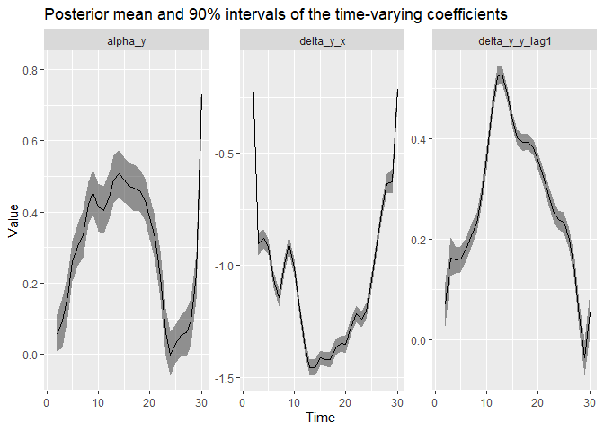
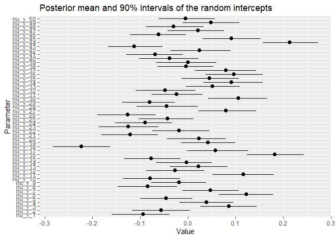
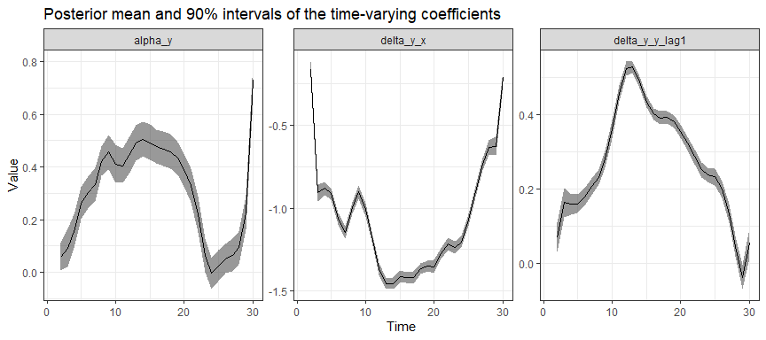
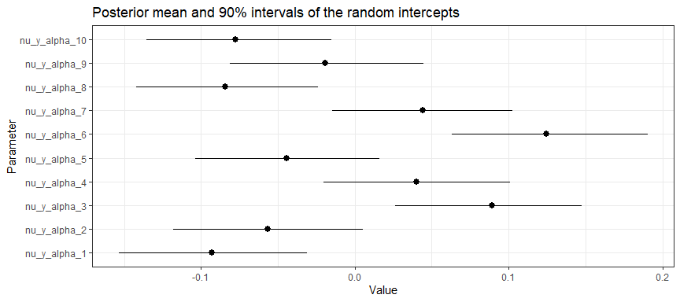
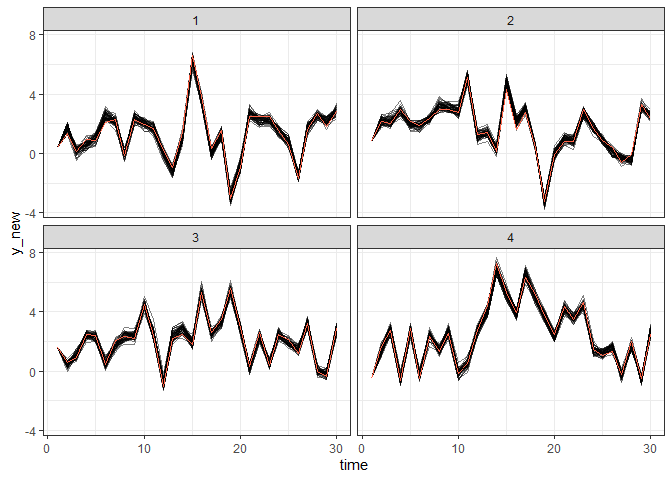

<!-- README.md is generated from README.Rmd. Please edit that file -->

# dynamite

<!-- badges: start -->

[](https://www.repostatus.org/#active)
[](https://github.com/ropensci/dynamite/actions)
[](https://app.codecov.io/gh/ropensci/dynamite?branch=main)
[](https://github.com/ropensci/software-review/issues/554)
<!-- badges: end -->

The `dynamite` [R](https://www.r-project.org/) package provides
easy-to-use interface for Bayesian inference of complex panel (time
series) data comprising of multiple measurements per multiple
individuals measured in time. The main features distinguishing the
package and the underlying methodology from many other approaches are:

- Support for both time-invariant and time-varying effects modeled via
  B-splines.
- Joint modeling of multiple measurements per individual (multiple
  channels) based directly on the assumed data generating process.
- Support for non-Gaussian observations: Currently Gaussian,
  Categorical, Poisson, Bernoulli, Binomial, Negative Binomial, Gamma,
  Exponential, and Beta distributions are available and these can be
  mixed arbitrarily in multichannel models.
- Allows evaluating realistic long-term counterfactual predictions which
  take into account the dynamic structure of the model by posterior
  predictive distribution simulation.
- Transparent quantification of parameter and predictive uncertainty due
  to a fully Bayesian approach.
- User-friendly and efficient R interface with state-of-the-art
  estimation via Stan. Both `rstan` and `cmdstanr` backends are
  supported.

The `dynamite` package is developed with the support of Academy of
Finland grant 331817 ([PREDLIFE](https://sites.utu.fi/predlife/en/)).

## Installation

You can install the development version of `dynamite` from
[GitHub](https://github.com/) by running one of the following lines:

``` r
# install.packages("devtools")
devtools::install_github("ropensci/dynamite")
install.packages("dynamite", repos = "https://ropensci.r-universe.dev")
```

## Example

A single-channel model with time-invariant effect of `z`, time-varying
effect of `x`, lagged value of the response variable `y` and a
group-specific random intercepts:

``` r
set.seed(1)
library(dynamite)
gaussian_example_fit <- dynamite(
  obs(y ~ -1 + z + varying(~ x + lag(y)), family = "gaussian") + 
    random() + splines(df = 20),
  data = gaussian_example, time = "time", group = "id",
  iter = 2000, warmup = 1000, thin = 5,
  chains = 2, cores = 2, refresh = 0, save_warmup = FALSE
)
```

Posterior estimates of the fixed effects:

``` r
plot_betas(gaussian_example_fit)
```



Posterior estimates of time-varying effects

``` r
plot_deltas(gaussian_example_fit, scales = "free")
#> Warning: Removed 1 row(s) containing missing values (geom_path).
```



And group-specific intercepts:

``` r
plot_nus(gaussian_example_fit)
```



Traceplots and density plots:

``` r
plot(gaussian_example_fit, type = "beta")
```



Posterior predictive samples for the first 4 groups (samples based on
the posterior distribution of model parameters and observed data on
first time point):

``` r
library(ggplot2)
pred <- predict(gaussian_example_fit, n_draws = 50)
pred |> dplyr::filter(id < 5) |> 
  ggplot(aes(time, y_new, group = .draw)) +
  geom_line(alpha = 0.5) + 
  # observed values
  geom_line(aes(y = y), colour = "tomato") +
  facet_wrap(~ id) +
  theme_bw()
```



For more examples, see the package vignette.

## Related packages

- The `dynamite` package uses Stan via
  [`rstan`](https://CRAN.R-project.org/package=rstan) and
  [`cmdstanr`](https://mc-stan.org/cmdstanr/) (see also
  <https://mc-stan.org>), which is a probabilistic programming language
  for general Bayesian modelling.

- The [`brms`](https://CRAN.R-project.org/package=brms) package also
  uses Stan, and can be used to fit various complex multilevel models.

- Regression modelling with time-varying coefficients based on kernel
  smoothing and least squares estimation is available in package
  [`tvReg`](https://CRAN.R-project.org/package=tvReg). The
  [`tvem`](https://CRAN.R-project.org/package=tvem) package provides
  similar functionality for gaussian, binomial and poisson responses
  with [`mgcv`](https://CRAN.R-project.org/package=mgcv) backend.

- [`plm`](https://CRAN.R-project.org/package=plm) contains various
  methods to estimate linear models for panel data, e.g. the fixed
  effect models.

- [`lavaan`](https://CRAN.R-project.org/package=lavaan) provides tools
  for structural equation modelling, and as such can be used to model
  various panel data models as well.

## Contributing

Contributions are very welcome, see
[CONTRIBUTING.md](https://github.com/ropensci/dynamite/blob/main/.github/CONTRIBUTING.md)
for general guidelines.
