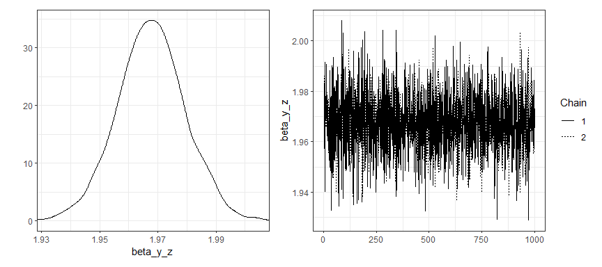
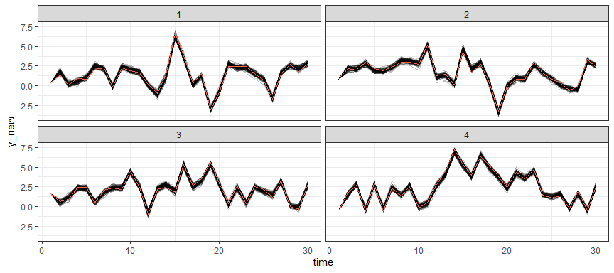

<!-- README.md is generated from README.Rmd. Please edit that file -->

# dynamite: Bayesian Modeling and Causal Inference for Multivariate Longitudinal Data <a href="https://docs.ropensci.org/dynamite/"></a>

<!-- badges: start -->

[](https://www.repostatus.org/#active)
[](https://github.com/ropensci/dynamite/actions)
[](https://app.codecov.io/gh/ropensci/dynamite?branch=main)
[](https://github.com/ropensci/software-review/issues/554)
[](https://ropensci.r-universe.dev)
[](https://cran.r-project.org/package=dynamite)
<!-- badges: end -->

The `dynamite` [R](https://www.r-project.org/) package provides an
easy-to-use interface for Bayesian inference of complex panel (time
series) data comprising of multiple measurements per multiple
individuals measured in time via dynamic multivariate panel models
(DMPM). The main features distinguishing the package and the underlying
methodology from many other approaches are:

- Support for regular time-invariant effects, group-level random
  effects, and time-varying effects modeled via Bayesian P-splines.
- Joint modeling of multiple measurements per individual (multiple
  channels) based directly on the assumed data generating process.
  Individual channels can be univariate or multivariate.
- Support for various distributions: Currently Gaussian, Multivariate
  Gaussian, Student t, Categorical, Multinomial, Poisson, Bernoulli,
  Binomial, Negative Binomial, Gamma, Exponential, and Beta
  distributions are available, and these can be combined arbitrarily in
  multichannel models.
- Allows evaluating realistic long-term counterfactual predictions which
  take into account the dynamic structure of the model by posterior
  predictive distribution simulation.
- Transparent quantification of parameter and predictive uncertainty due
  to a fully Bayesian approach.
- User-friendly and efficient R interface with state-of-the-art
  estimation via Stan. Both `rstan` and `cmdstanr` backends are
  supported.

The `dynamite` package is developed with the support of the Research
Council of Finland grant 331817
([PREDLIFE](https://sites.utu.fi/predlife/en/)). For further information
on DMPMs and the `dynamite` package, see the related
[arXiv](https://arxiv.org/abs/2302.01607) and
[SocArXiv](https://osf.io/preprints/socarxiv/mdwu5/) preprints.

## Installation

You can install the most recent stable version of `dynmite` from
[CRAN](https://cran.r-project.org/package=dynamite) or the development
version from [R-universe](https://r-universe.dev/search/) by running one
the following lines:

``` r
install.packages("dynamite")
install.packages("dynamite", repos = "https://ropensci.r-universe.dev")
```

## Example

A single-channel model with time-invariant effect of `z`, time-varying
effect of `x`, lagged value of the response variable `y` and a
group-specific random intercepts:

``` r
set.seed(1)
library("dynamite")
gaussian_example_fit <- dynamite(
  obs(y ~ -1 + z + varying(~ x + lag(y)) + random(~1), family = "gaussian") +
    splines(df = 20),
  data = gaussian_example, time = "time", group = "id",
  iter = 2000, chains = 2, cores = 2, refresh = 0
)
```

Summary of the model:

``` r
print(gaussian_example_fit)
#> Model:
#>   Family   Formula                                       
#> y gaussian y ~ -1 + z + varying(~x + lag(y)) + random(~1)
#> 
#> Correlated random effects added for response(s): y
#> 
#> Data: gaussian_example (Number of observations: 1450)
#> Grouping variable: id (Number of groups: 50)
#> Time index variable: time (Number of time points: 30)
#> 
#> NUTS sampler diagnostics:
#> 
#> No divergences, saturated max treedepths or low E-BFMIs.
#> 
#> Smallest bulk-ESS: 661 (sigma_nu_y_alpha)
#> Smallest tail-ESS: 1058 (sigma_nu_y_alpha)
#> Largest Rhat: 1.003 (sigma_y)
#> 
#> Elapsed time (seconds):
#>         warmup sample
#> chain:1  5.511  3.354
#> chain:2  5.504  3.462
#> 
#> Summary statistics of the time- and group-invariant parameters:
#> # A tibble: 6 × 10
#>   variable      mean median      sd     mad     q5   q95  rhat ess_bulk ess_tail
#>   <chr>        <dbl>  <dbl>   <dbl>   <dbl>  <dbl> <dbl> <dbl>    <dbl>    <dbl>
#> 1 beta_y_z    1.97   1.97   0.0116  0.0112  1.95   1.99   1.00    2815.    1434.
#> 2 sigma_nu_y… 0.0944 0.0933 0.0114  0.0107  0.0780 0.114  1.00     661.    1058.
#> 3 sigma_y     0.198  0.198  0.00373 0.00362 0.192  0.204  1.00    2580.    1254.
#> 4 tau_alpha_y 0.212  0.205  0.0483  0.0432  0.146  0.301  1.00    1731.    1606.
#> 5 tau_y_x     0.364  0.355  0.0740  0.0648  0.266  0.494  1.00    2812.    1504.
#> 6 tau_y_y_la… 0.107  0.105  0.0219  0.0213  0.0781 0.148  1.00    2387.    1682.
```

Posterior estimates of time-varying effects:

``` r
plot(gaussian_example_fit, plot_type = "delta", scales = "free")
```


And group-specific intercepts:

``` r
plot(gaussian_example_fit, plot_type = "nu", groups = 1:10)
```


Traceplots and density plots for time-invariant parameters:

``` r
plot(gaussian_example_fit, type = "beta")
```



Posterior predictive samples for the first 4 groups (samples based on
the posterior distribution of model parameters and observed data on
first time point):

``` r
library("ggplot2")
pred <- predict(gaussian_example_fit, n_draws = 100)
pred |>
  dplyr::filter(id < 5) |>
  ggplot(aes(time, y_new, group = .draw)) +
  geom_line(alpha = 0.25) +
  # observed values
  geom_line(aes(y = y), colour = "tomato") +
  facet_wrap(~id) +
  theme_bw()
```



For more examples, see the package vignette and the [blog post about
dynamite](https://ropensci.org/blog/2023/01/31/dynamite-r-package/).

## Related packages

- The `dynamite` package uses Stan via
  [`rstan`](https://CRAN.R-project.org/package=rstan) and
  [`cmdstanr`](https://mc-stan.org/cmdstanr/) (see also
  <https://mc-stan.org>), which is a probabilistic programming language
  for general Bayesian modelling.
- The [`brms`](https://CRAN.R-project.org/package=brms) package also
  uses Stan, and can be used to fit various complex multilevel models.
- Regression modeling with time-varying coefficients based on kernel
  smoothing and least squares estimation is available in package
  [`tvReg`](https://CRAN.R-project.org/package=tvReg). The
  [`tvem`](https://CRAN.R-project.org/package=tvem) package provides
  similar functionality for gaussian, binomial and poisson responses
  with [`mgcv`](https://CRAN.R-project.org/package=mgcv) backend.
- [`plm`](https://CRAN.R-project.org/package=plm) contains various
  methods to estimate linear models for panel data, e.g., fixed effect
  models.
- [`lavaan`](https://CRAN.R-project.org/package=lavaan) provides tools
  for structural equation modeling, and as such can be used to model
  various panel data models as well.

## Contributing

Contributions are very welcome, see
[CONTRIBUTING.md](https://github.com/ropensci/dynamite/blob/main/.github/CONTRIBUTING.md)
for general guidelines.
